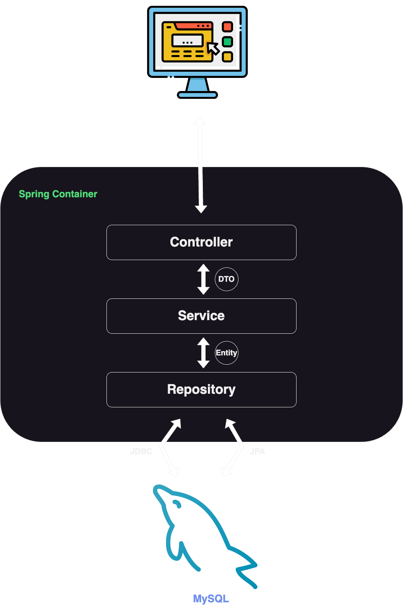

## 🚀 Intro

---

```
커뮤니티 서비스를 위한 백엔드 서버 프로젝트입니다.
```

<br>

### 설계목표

- **JWT 기반 인증 구현**  
- **유저 기능 → JdbcTemplate 적용**
- **게시판 기능 → JPA, QueryDSL 적용**
- **레이어 간의 완전한 독립**
- **레이어끼리 통신 규칙 통일**
- **모든 예외처리 최종 책임은 컨트롤러**
- **클래스, 메서드, 변수 이름을 통해 최대한 의도를 드러냄**

<br>

#### Demo

__[🔗 커뮤니티 서비스 데모 영상](https://youtu.be/o1n0EyZVABo)__


<br>


#### Frontend Servers

__[🔗 Frontend Server - Vanilla](https://github.com/100-hours-a-week/5-ian-jeong-community-frontend-vanilla-spring)__    
__[🔗 Frontend Server - React](https://github.com/100-hours-a-week/5-ian-jeong-community-front-react)__


<br>

#### Tech Stacks


 


#### Dev Env

[](https://www.apple.com/macos/big-sur/)
[](https://www.jetbrains.com/idea/)


<br>


<br><br><br><br>

## 🗂️ Directory Structure

---

```java
community
|
|
|------ CommunityApplication.class
    |
    |
    |-- auth  // JWT 패키지 
    |   | 
    |   |-- JWTFilter.class  // 인증필터
    |   |-- JWTToken.class   // jwt record
    |   |-- JWTUtil.class    // jwt 생성 및 인증 담당 
    |
    |
    |-- config  // configuration 패키지
    |   |
    |   |-- db  // db 관련 config
    |   |   |
    |   |   |-- JDBCConfig.class
    |   |   |-- QueryDSLConfig.class
    |   |   
    |   |-- ratelimit  // 시간 당 요청제한 모듈 패키지
    |   |   |
    |   |   |-- RateLimitConfig.class
    |   |   |-- RateLimitInterceptor.class
    |   |
    |   |-- security  // spring security config
    |       |
    |       |-- CorsConfig.class  
    |       |-- SecurityConfig.class
    |     
    |
    |-- constant  // 전역상수 패키지
    |   |
    |   |-- ErrorMessage.class
    |
    |
    |-- controller  // 인증, 유저, 게시글 컨트롤러 패키지
    |   |
    |   |-- auth
    |   |   |
    |   |   |-- AuthController.class
    |   |   |-- AuthControllerImpl.class
    |   |
    |   |-- post
    |   |   |
    |   |   |-- PostController.class
    |   |   |-- PostControllerImpl.class
    |   |
    |   |-- user
    |       |
    |       |-- UserController.class
    |       |-- UserControllerImpl.class
    |
    |
    |-- domain  // 유저, 게시글 도메인 
    |   |
    |   |-- collection  
    |   |   |  
    |   |   |--Users.class // 유저 객체의 일급 컬렉션
    |   |
    |   |-- dto  // HTTP 요청 - 컨트롤러, 컨트롤러 - 서비스 사이에서의 전달 데이터 래핑 상자
    |   |   |
    |   |   |-- UserDTO.class
    |   |   |-- PostDTO.class
    |   |   |-- CommentDTO.class
    |   |   |-- PostDetailDTO.class
    |   |
    |   |
    |   |-- entity  // 컨트롤러 - 레포지토리 사이에서의 전달 데이터 래핑 상자, 디비 테이블 매핑 객체
    |       |
    |       |-- User.class
    |       |-- Post.class
    |       |-- Comment.class
    |
    |
    |-- functional  // 비밀번호 암호화 메서드를 DTO에 전달하기 위한 함수형 인터페이스
    |   |
    |   |-- Encoder.class
    |   |-- PasswordValidator.class
    |
    |
    |-- repository  // 유저, 게시글, 댓글 저장소
    |   |
    |   |
    |   |-- comment
    |   |   |
    |   |   |-- CommentRepository.class        // JPA repo
    |   |   |-- CommentRepositoryCustom.class  // querydsl 사용경험을 위한 커스텀 레포
    |   |   |-- CommentRepositoryImpl.class
    |   |
    |   |-- post
    |   |   |
    |   |   |-- PostRepository.class
    |   |   |-- PostRepositoryCustom.class
    |   |   |-- PostRepositoryImpl.class
    |   |
    |   |-- user  // JDBC만 사용하기 떄문에 커스텀 레포없음
    |       |-- UserRepository.class  
    |       |-- UserRepositoryImpl.class
    |
    |
    |-- response  // 요청에 대한 응답관련 패키지
    |   |
    |   |-- ResponseData
    |   |-- ResponseHandler
    |
    |
    |-- service  // 인증, 유저, 게시글 서비스 패키지
        |
        |-- auth
        |   |
        |   |-- AuthService.class
        |   |-- AuthServiceImpl.class
        | 
        |-- post
        |   |
        |   |-- PostService.class
        |   |-- PostServiceImpl.class
        |
        |-- user
            |
            |-- UserService.class
            |-- UserServiceImpl.class


```


<br><br><br><br><br>


## 🏯 Architecture

---




<br><br>


```
서버의 구조는 위 이미지와 같습니다.

컨트롤러에 의해서 요청 및 응답이 처리될 수 있습니다.
컨트롤러는 요청을 수행하기 위해 서비스 레이어의 의존합니다.

서비스 레이어는 컨트롤러의 호출에 의해서 해당 비즈니스 로직을 수행합니다.
비즈니스 로직 수행을 위한 데이터는 레포지토리 레이어에 의존해서 데이터를 가져올 수 있습니다.

레포지토리 레이어는 해당언어 및 프레임워크의 데이터베이스 접근 기술을 사용해서 스프링 앱 외부에 존재하는
데이터베이스 서버에 접근해서 엔티티에 대한 CRUD를 수행합니다.
```

<br>

#### ✅ Request & Response
```
요청 & 응답의 프로세스를 살펴보겠습니다.
```

1️⃣ HTTP 요청이 들어옵니다.  
2️⃣ 요청에 매핑되는 엔드포인트를 찾아서 컨트롤러 로직을 실행합니다.  
3️⃣ 컨트롤러는 DTO 를 서비스 레이어에 전달하면서 비즈니스 로직을 요청합니다.  
4️⃣ 서비스 레이어는 비즈니스 로직 수행을 위해서 레포지토리에 Entity 를 전달해서 데이터를 요청합니다.  
5️⃣ 레포지토리에서 데이터베이스에 접근하여 Entity에 대한 작업을 수행하고 결과를 서비스 레이어 전달합니다.  
6️⃣ 서비스 레이어는 요청받은 작업을 모두 수행하고 컨트롤러에게 DTO로 응답합니다.  
7️⃣ 마지막으로, 컨트롤러는 전달받은 결과 혹은 DTO를 응답으로 내려줍니다.


<br><br><br><br><br>

## 🔍 Details

---

<details>
<summary>application.properties</summary>

```java
spring.application.name=community


#encoding
server.servlet.encoding.charset=UTF-8
server.servlet.encoding.force=true
server.servlet.encoding.enabled=true


#dbms
spring.datasource.url=
spring.datasource.username=
spring.datasource.password=
spring.datasource.driver-class-name=com.mysql.cj.jdbc.Driver


#cors
cors.allowed.origins=


#Tomcat
server.connection-timeout=5000


#jwt
expired.time=3600000
refresh.expired.time=86400000
secret.key=testSecretKey20230327testSecretKey20230327testSecretKey20230327


#jackson
spring.jackson.date-format=yyyy-MM-dd HH:mm:ss
```

인코딩, dbms 커넥션 정보, allowed origin 등등 코드에서 노출 되어서는 안될 변수들을 위주로  
properties 에 작성해주었습니다.

</details>

<details>
<summary>Security</summary>

**RateLimitConfig**

```java
@Configuration
public class RateLimitConfig {

    @Bean
    public Bucket bucket() {
        Bandwidth limit = Bandwidth.classic(50, Refill.greedy(1000, Duration.ofMinutes(1)));
        return Bucket4j.builder().addLimit(limit).build();
    }
}
```

- 지정된 시간 동안의 요청 수를 제한하여 과도한 요청으로 인한 악의적인 리소스 고갈을 방지하는 데 사용됩니다.
- 초당 50개의 요청을 허용합니다.
- 매 1분마다 최대 1000개의 토큰을 버킷에 채웁니다.
- 리필 속도에 따라서 다음 리필까지 충분한 토큰이 없으면 요청이 거부될 수 있습니다.

<br><br>

**RateLimitInterceptor**

```java
@Component
public class RateLimitInterceptor implements HandlerInterceptor {

    @Autowired
    private Bucket bucket;

    @Override
    public boolean preHandle(HttpServletRequest request, HttpServletResponse response, Object handler) throws Exception {
        if (bucket.tryConsume(1)) {
            return true;
        } else {
            response.setStatus(HttpStatus.TOO_MANY_REQUESTS.value());
            response.getWriter().write("Too many requests");
            return false;
        }
    }
}
```

- **HandlerInterceptor 의 구현체 클래스입니다.**
- **요청이 처리되기 전에 실행되며, 요청 제한 초과 여부를 확인하는 역할을 수행합니다.**

<br><br>

**CorsConfig**

```java
@Configuration
public class CorsConfig implements WebMvcConfigurer {
    @Value("${cors.allowed.origins}")
    private String allowedOrigins;

    @Autowired
    private RateLimitInterceptor rateLimitInterceptor;

    @Override
    public void addCorsMappings(CorsRegistry registry) {
        registry.addMapping("/**")
                .allowedMethods("GET", "POST", "PATCH", "DELETE")
                .allowedOrigins(allowedOrigins)
                .exposedHeaders("Authorization", "RefreshToken")
                .allowCredentials(true);

    }

    @Override
    public void addInterceptors(InterceptorRegistry registry) {
        registry.addInterceptor(rateLimitInterceptor);
    }
}
```

- **CORS 설정을 추가합니다.**
- **모든 경로에 대해 CORS 세팅값을 적용합니다.**
- **addInterceptors 를 통해서 아까 작성했던 rateLimit 인터셉터를 등록합니다.**
    - **요청이 들어올 때마다 실행되어 요청 제한을 적용합니다.**


<br><br>

**SecurityConfig**

```java
@Configuration
@RequiredArgsConstructor
@EnableWebSecurity(debug = true)
public class SecurityConfig {
    private final JWTFilter jwtFilter;

    @Bean
    public AuthenticationManager authenticationManager(AuthenticationConfiguration configuration) throws Exception {
        return configuration.getAuthenticationManager();
    }

    @Bean
    public PasswordEncoder passwordEncoder() {
        return new BCryptPasswordEncoder();
    }

    @Bean
    public SecurityFilterChain filterChain(HttpSecurity http) throws Exception {
        http
                .httpBasic(AbstractHttpConfigurer::disable)  // HTTP Basic 인증을 비활성화
                .csrf(AbstractHttpConfigurer::disable)  // CSRF 보호 기능을 비활성화
                .formLogin(AbstractHttpConfigurer::disable)  // 폼 기반 로그인을 비활성화(기본 로그인 페이지를 사용하지 않도록 설정)
                .cors(withDefaults()) // CorsConfig 작성내용 적용

                .authorizeHttpRequests((requests) -> {
                    requests.requestMatchers(
                                    "/",
                                    "/users",
                                    "/users/email",
                                    "/users/nickname",
                                    "/users/sign-up",
                                    "/auth/sign-in",
                                    "/auth/refresh-token"
                            ).permitAll()  // 인증없이 요청가능
                            .anyRequest().authenticated();
                })

                .addFilterAt(jwtFilter, UsernamePasswordAuthenticationFilter.class)  // HTTP 요청을 가로채서 JWT 토큰의 유효성을 검사하고 사용자를 인증
                .sessionManagement((session) -> session
                .sessionCreationPolicy(SessionCreationPolicy.STATELESS)); // 세션 사용 X

        return http.build();
    }
}
```

- **AuthenticationManager 를 빈으로 등록합니다.**
- **유저 비밀번호 암호화를 책임질 BCryptPasswordEncoder 를 빈으로 등록합니다.**
- **SecurityFilterChain을 빈으로 등록합니다.**
    - 특정 엔드포인트 접근 권한을 세탕합니다.
    - 세션을 사용하지 않고, 모든 요청은 JWT 토큰 인증을 통해 이뤄집니다.

</details>


<details>
<summary>JWT</summary>

**JWTToken**

```java
public record JWTToken(String accessToken, String refreshToken) {}
```

- record 클래스 타입을 통해서 불변 클래스를 심플하게 작성했습니다.
- 발급받은 토큰이 할당됩니다.

<br><br>

**JWTUtil**

```java
@Component
public class JWTUtil {
    @Value("${expired.time}")
    private Long expiredTime;

    @Value("${refresh.expired.time}")
    private Long refreshExpiredTime;

    @Value("${secret.key}")
    private String secret;

    private SecretKey secretKey;

    @PostConstruct
    public void init() {
        secretKey = new SecretKeySpec(secret.getBytes(StandardCharsets.UTF_8), Jwts.SIG.HS256.key().build().getAlgorithm());
    }

    public Long getId(String token) {...}
    public boolean isExpired(String token) {...}
    public JWTToken createJwt(Long id) {...}
}
```

- **@PostConstruct 어노테이션으로 초기화 메서드를 정의합니다.**
    - **secret 으로 secretKey를 생성합니다.**
- **getId() → 토큰의 id 클래임을 추출합니다.**
- **isExpired() → 토큰의 만료기간이 유효한지 확인합니다.**
- **createJwt() → 인자로 주어진 사용자 id 기반으로 Access 토큰과 refresh 토큰을 생성합니다.**

<br><br>

**JWTFilter**

```java
@Component
@RequiredArgsConstructor
public class JWTFilter extends OncePerRequestFilter {
    private final JWTUtil jwtUtil;

    @Override
    protected void doFilterInternal(HttpServletRequest request, HttpServletResponse response, FilterChain filterChain) throws ServletException, IOException {
        final String authorization = request.getHeader(HttpHeaders.AUTHORIZATION);

        if(authorization == null || !authorization.startsWith("Bearer ")){
            filterChain.doFilter(request, response);
            return;
        }

        String token = authorization.split(" ")[1];

        if(jwtUtil.isExpired(token)){
            filterChain.doFilter(request, response);
            return;
        }

        Long id = jwtUtil.getId(token);

        UsernamePasswordAuthenticationToken authenticationToken =
                new UsernamePasswordAuthenticationToken(id, null, List.of(new SimpleGrantedAuthority("USER")));

        authenticationToken.setDetails(new WebAuthenticationDetailsSource().buildDetails(request));
        SecurityContextHolder.getContext().setAuthentication(authenticationToken);
        filterChain.doFilter(request, response);
    }
}
```

- **OncePerRequestFilter 를 상속받아서 구현된 JWT 검증 필터입니다.**
- **HTTP 요청에서 JWT를 추출해서 유효성을 검사합니다.**
    1. **Authorization 헤더를 추출합니다.**
    2. **“Bearer “ 로 시작하는지 확인합니다. → 실패하면 401**
    3. **토큰 만료여부를 확인합니다. → 만료되었으면 401**
    4. **추출한 사용자 ID를 기반으로 UsernamePasswordAuthenticationToken 인스턴스를 생성합니다.**
    5. **setDatils를 통해서 인증에 필요한 세팅을 진행합니다.**
    6. **인증 인스턴스를 세팅합니다.**
    7. **모든 과정이 완료되면 다음 필터로 요청을 전달합니다.**


<br><br>

**✅ 인증 프로세스**

```java
1. 로그인 검증에 성공하면 해당 유저는 토큰을 전달받습니다.
2. 웰컴 페이지, 로그인 페이지, 회원가입 페이지를 제외한 모든 페이지에서 위 인증 필터링을 진행합니다.
3. 위 필터링에 더해서, 클라이언트 측에서 접속 유저 아이디를 얻기 위해 인증 API를 호출합니다.
4-1. 인증이 유효하면 해당 유저 id를 응답받습니다.
4-2. 유효하지 않다면, 리프레쉬 토큰 유효성 검사 API 호출합니다.
	- 리프레쉬 토큰이 유효하다면 어세스 토큰과 리프레쉬 토큰을 세로 발급해줍니다.
	- 리프레쉬 토큰도 유효하지 않다면 401 응답을 받고, 클라이언트 측에서 로그인페이지로 리다이렉트됩니다.
```

**현재 적용된 인증 프로세스 스프링의 security 필터링을 제대로 활용하지 않은 형태입니다.**

**dofileterInternal() 인증 이후에 클라이언트 측에서 추가적으로 인증 요청을 서버로 보내고 응답 상태를   
통해서 리프레쉬 토큰 인증 요청까지 보내는 형태입니다.**

**모두 적용한 이후에 인지했으며, doFilterInteral()에서 인증에 실패한다면 리프레쉬 토큰까지 검사하고   
재발급해주는 과정을 넣어야 더 바람직한 구현이라는 것을 알게되었습니다. 🥲**

</details>


<details>

<summary>Response</summary>

**ResponseData**

```java
@Getter
public class ResponseData<T> {
    private T result;
    private PostDTO post;
    private List<CommentDTO> comments;

    public ResponseData(T result) {
        if (result instanceof PostDetailDTO) {
            post = ((PostDetailDTO) result).getPostDTO();
            comments = ((PostDetailDTO) result).getCommentsDTO();

            return;
        }

        this.result = result;
    }
}
```

- **응답 제이슨 데이터를 위한  클래스입니다.**
- **데이터의 타입이 PostDetailDTO 라면 초기화 되는 멤버가 달라집니다.**
    - **게시글 상세 데이터 요청에서 게시글 데이터와 댓글들의 수 일관성을 위해서  함께 응답으로 내려줘야 하기 때문입니다.**


<br><br>

**ResponseHandler**

```java
@Slf4j
public class ResponseHandler {

    public static ResponseEntity<Void> handleException(Exception e, String errorMessage, HttpStatus status) {
        log.error(errorMessage, e);
        return ResponseEntity.status(status).build();
    }

    public static <T> ResponseEntity<ResponseData<T>> handleResponse(T data, HttpStatus status) {
        ResponseData<T> responseData = new ResponseData<>(data);
        return new ResponseEntity<>(responseData, status);
    }

    public static ResponseEntity<Void> handleResponse(HttpStatus status) {
        return new ResponseEntity<>(status);
    }

    public static ResponseEntity<Void> handleResponse(JWTToken token) {
        HttpHeaders headers = new HttpHeaders();
        headers.set(HttpHeaders.AUTHORIZATION, "Bearer " + token.accessToken());
        headers.set("RefreshToken", "Bearer " + token.refreshToken());

        return ResponseEntity.ok().headers(headers).build();
    }
}
```

- **응답이 될 ResponseEntitu를 생성해서 반환해주는 Handler클래스입니다**
- **user와 post 컨트롤러에서 사용되며, 위 핸들러를 컴포넌트로 만들고 컨트롤러의 멤버로 넣는 것 보다는 static 메서드들로 구성하여 util 클래스 사용하는 것이 의존성을 줄이고 범용성을 높이는 방법이라고 생각했습니다.**
- **예외 발생에 대한 응답도 담당합니다.**
- **handleException() → 예외 객체와 에러 메시지를 전달받아서 서버에 로그를 남기고 상태코드로만 응답합니다.**
- **handleResponse() → 상태코드, 데이터 + 상태코드, jwt를 응답형태로 만들어서 반환합니다. 오버로딩을 적용했습니다.**

</details>

<details>
<summary>Auth</summary>

**AuthContoller**

```java
public interface AuthController {
    ResponseEntity<?> getUserId(String accessToken);
    ResponseEntity<?> validateAccount(UserDTO userDTO);
    ResponseEntity<?> validateRefreshToken(String refreshToken, UserDTO userDTO);
}
```

- **인증 컨트롤러의 인터페이스입니다.**
- **getUserId() → 토큰의 유효성을 검사하고 인자로 전달받은 토큰에서 id 를 추출합니다.**
- **validateAccount() → 로그인 시 호출되는 메서드이고, 계정이 유효하다면 토큰을 발급합니다.**
- **validateRefreshToken() → 리프레쉬 토큰의 유효성을 검사하고, 유효하다면 JWT를 새로 발급합니다.**

<br><br>

**AuthControllerImpl**

```java
@Slf4j
@RestController
@RequestMapping("/auth")
@RequiredArgsConstructor
public class AuthControllerImpl implements AuthController {
    private final AuthService authService;

    @Override
    @GetMapping
    public ResponseEntity<?> getUserId(@RequestHeader("Authorization") String accessToken) {
        try {
            return handleResponse(authService.getUserId(accessToken), HttpStatus.OK);

        } catch(IllegalArgumentException e) {
            return handleException(e, ERROR_AUTH, HttpStatus.UNAUTHORIZED);
        }
    }

    @Override
    @PostMapping("/sign-in")
    public ResponseEntity<?> validateAccount(@RequestBody UserDTO userDTO) {
        try {
            return handleResponse(authService.validateAccount(userDTO));

        } catch(IllegalArgumentException e) {
            return handleException(e, ERROR_AUTH, HttpStatus.UNAUTHORIZED);
        } catch (RuntimeException e) {
            return handleException(e, ERROR_SIGN_IN, HttpStatus.INTERNAL_SERVER_ERROR);
        }
    }

    @Override
    @PostMapping("/refresh-token")
    public ResponseEntity<?> validateRefreshToken(
            @RequestHeader("Authorization") String refreshToken,
            @RequestBody UserDTO userDTO
    ) {
        try {
            return handleResponse(authService.validateRefreshToken(refreshToken, userDTO));

        } catch(IllegalArgumentException e) {
            return handleException(e, ERROR_AUTH, HttpStatus.UNAUTHORIZED);
        } catch (RuntimeException e) {
            return handleException(e, ERROR_RUNTIME, HttpStatus.INTERNAL_SERVER_ERROR);
        }
    }
}
```

- **AuthController의 구현체입니다**
- **getUserId() → 인자로 헤더의 Authorization 값을 받아서 authService의 getUserId()를   
호출해서 유저 아이디를 요청합니다.**
- **validateAccount() → 인자로 유저의 계정과 비밀번호가 담긴 DTO를 전달받아서 authService에게   
검증을 요청합니다.**
- **validateRefreshToken() → 인자로 리프레쉬 토큰과 유저 아이디가 담긴 DTO를 전달받아서  
authService에게 리프레쉬토큰 유효성검사를 요청합니다.**

<br><br>

**AuthService**

```java
public interface AuthService {
    Long getUserId(String accessToken);
    JWTToken validateAccount(UserDTO userDTO);
    JWTToken validateRefreshToken(String refreshToken, UserDTO userDTO);
}
```

- **인증 서비스의 인터페이스입니다.**
- **getUserId() → 전달받은 토큰 페이로드에서 id를 추출합니다.**
- **validateAccount() → 유저의 계정을 검증하고 JWT를 발급합니다.**
- **validateRefreshToken() → 리프레쉬 토큰의 유효성을 검사하고 JWT를 새로 발급합니다.**

<br><br>

**AuthServiceImpl**

```java
@Service
@RequiredArgsConstructor
public class AuthServiceImpl implements AuthService {
    private final UserRepository userRepository;
    private final PasswordEncoder passwordEncoder;
    private final JWTUtil jwtUtil;

    @Override
    public Long getUserId(String accessToken) {
        if(jwtUtil.isExpired(accessToken)) {
            throw new IllegalArgumentException();
        }

        return jwtUtil.getId(accessToken);
    }

    @Override
    public JWTToken validateAccount(UserDTO userDTO) {
        Users users = new Users(userRepository.selectAll());
        Long id = users.validateAccount(userDTO, passwordEncoder::matches);

        if(id == 0) {
            throw  new IllegalArgumentException();
        }

        return jwtUtil.createJwt(id);
    }

    @Override
    public JWTToken validateRefreshToken(String refreshToken, UserDTO userDTO) {
        if (jwtUtil.isExpired(refreshToken)) {
            throw  new IllegalArgumentException();
        }

        return jwtUtil.createJwt(userDTO.getId());
    }
}
```

- **AuthService의 구현체입니다.**
- **getUserId() → jwtUtil 컴포넌트를 통해서 전달받은 토큰의 만료기간을 검증하고 유저아이디를 추출해서 반환합니다.**
- **validateAccount() → userRepository에서 모든 유저를 조회해서 user 일급 컬렉션에 담습니다.**

  **일급컬렉션 내부에 있는 검증 메서드를 통해서 계정이 유효한지 확인합니다.**

  **페스워드 검증은 PasswordEncoder의 메서드를 사용해야 하지만 일급컬렉션의 추가적인 멤버는 좋지 않은 형태라고 생각해서 함수형 인터페이스를 활용해서 인자로 검증 메서드를 전달했습니다.**

- **validateRefreshToken() → 인자로 전달받은 리프레쉬 토큰의 유효성을 검사하고 토큰을 새로 생성해서 반홥합니다.**


</details>

<details>
<summary>User</summary>


</details>

<br><br><br><br><br>

## 📝 Community Service API

---

__<span style="color: blue;">[POST]</span> '/users'__
```
새로운 유저를 생성합니다.
userDAO를 통해서 단일 쿼리를 실행합니다.
```


<br>

__<span style="color: blue;">[POST]</span> '/users/sign-in’__
```
로그인을 위해 검증 요청을 날립니다.
GET으로 날릴 경우 유저가 입력한 이메일, 패스워드를 query parameter로 실어서 보내야 하기때문에 보안에 취약합니다.
POST를 통해 body에 담아서 노출시키지 않음을 의도했습니다.
userDAO를 통해서 단일 쿼리를 실행합니다.
```


<br>

__<span style="color: orange;">[GET]</span> '/users/email’__
```
회원가입 페이지에서 이메일 중복 검증 요청을 날립니다.
위 경우와는 다르게, 패스워드가 아닌 이메일이기 때문에 GET으로 날렸습니다.
userDAO를 통해서 단일 쿼리를 실행합니다.
```


<br>


__<span style="color: orange;">[GET]</span> '/users/nickname’__
```
회원가입 페이지에서 닉네임 중복 검증 요청을 날립니다.
위 경우와 마찬가지 입니다.
userDAO를 통해서 단일 쿼리를 실행합니다.
```


<br>

__<span style="color: orange;">[GET]</span> '/users/:userId’__
```
path variable에 해당하는 유저 아이디를 가진 유저 데이터를 요청합니다.
웰컴, 로그인, 회원가입을 제외한 모든 페이지 헤더에는 유저의 프로필 사진이 있습니다.
그렇기 때문에 페이지 진입 마다 해당 요청을 날려줘야 합니다.

해당 유저아이디는 로그인 이후, 세션 스토어에 저장된 유저 아이디를 매번 받아옵니다.
세션이 만료되었거나 로그인을 거치지 않았다면 세션 스토어에 유저 아이디가 저장되지 않도록 구현되어 있습니다.

userDAO를 통해서 단일 쿼리를 실행합니다.
```


<br>

__<span style="color: purple;">[PATCH]</span> '/users/:userId’__
```
회원정보수정 페이지에서 유저 정보의 업데이트를 요청합니다.
userDAO를 통해서 단일 쿼리를 실행합니다.
```


<br>

__<span style="color: purple;">[PATCH]</span> '/users/:userId/password’__
```
회원 비밀번호 수정 페이지에서 유저의 비밀번호 업데이트를 요청합니다.
userDAO를 통해서 단일 쿼리를 실행합니다.
```


<br>

__<span style="color: red;">[DELETE]</span> '/users/:userId’__
```
회원정보수정 페이지에서 유저 삭제를 요청합니다.
userDAO를 통해서 단일 쿼리를 실행합니다.
```


<br>


__<span style="color: blue;">[POST]</span> ‘/posts’__
```
게시글 작성 페이지에서 게시글 생성을 요청합니다.
postDAO를 통해서 단일 쿼리를 실행합니다.
```


<br>

__<span style="color: orange;">[GET]</span> ‘/posts’__
```
게시글 목록 페이지에서 게시글 목록을 요청합니다.
postDAO를 통해서 단일 쿼리를 실행합니다.
```


<br>

__<span style="color: orange;">[GET]</span> ‘/posts/:postId’__
```
게시글 상세 페이지에서 path variable에 있는 아이디를 가지는 게시글을 요청합니다.
해당 요청은 3개의 쿼리를 트랜잭션으로 묶어서 처리합니다.
요청 쿼리는 다음과 같습니다.

1. 게시글 조회수 업데이트
2. 게시글 조회
3. 댓글 목록 조회

조회수 업데이트, 게시글 조회, 댓글 목록 조회를 따로 하게 된다면 유저 입장에서 불일치 문제가 생길 수 있습니다.

예를 들어, 
누군가가 게시글을 조회합니다. 댓글 목록 조회 쿼리 수행 이전에 댓글을 추가한다면
게시글 칼럼에 들어있는 댓글 카운트와 실제 댓글 수가 상이할 수 있습니다.

postDAO를 통해서 3개의 쿼리를 하나의 트랜잭션으로 실행합니다.
```


<br>

__<span style="color: purple;">[PATCH]</span> ‘/posts/:postId’__
```
게시글 수정 페이지에서 path variable에 있는 아이디를 가지는 게시글의 업데이트를 요청합니다.
postDAO를 통해서 단일 쿼리를 실행합니다.
```


<br>


__<span style="color: blue;">[POST]</span> ‘/posts/:postId/comments’__
```
게시글 상세 페이지에서 해당 path variable에 있는 아이디를 가지는 게시글에다가 댓글 생성을 요청합니다.
postDAO를 통해서 단일 쿼리를 실행합니다.
```


<br>

__<span style="color: purple;">[PATCH]</span> ‘/posts/:postId/comments/:commentId’__
```
게시글 상세 페이지에서 path variable에 있는 아이디를 가지는 댓글 업데이트를 요청합니다.
postDAO를 통해서 단일 쿼리를 실행합니다.
```


<br>


__<span style="color: red;">[DELETE]</span> ‘/posts/:postId/comments/:commentId’__
```
게시글 상세 페이지에서 path variable에 있는 아이디를 가지는 댓글 삭제를 요청합니다.
postDAO를 통해서 단일 쿼리를 실행합니다.
```


<br>

__<span style="color: red;">[DELETE]</span> ‘/posts/:postId’__

```
게시글 상세 페이지에서 path variable에 있는 아이디를 가지는 게시글 삭제를 요청합니다.
postDAO를 통해서 단일 쿼리를 실행합니다.
```


<br>


<br><br><br><br><br>


